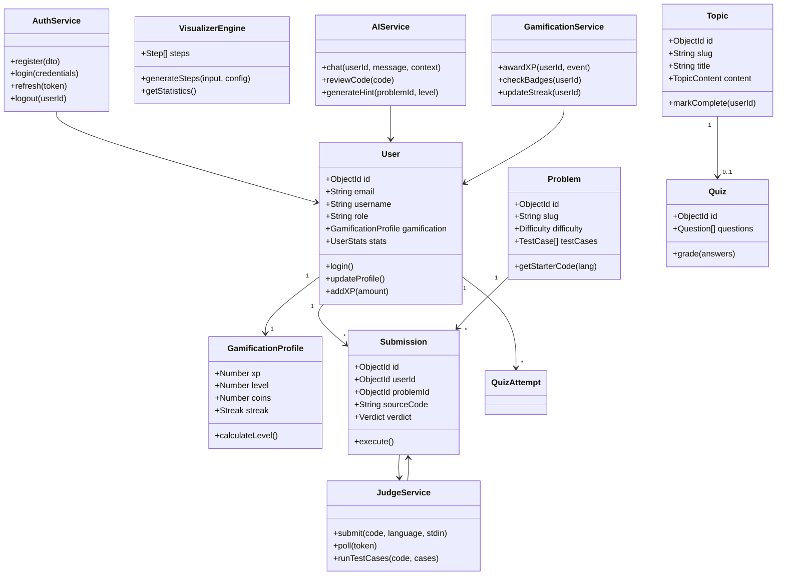
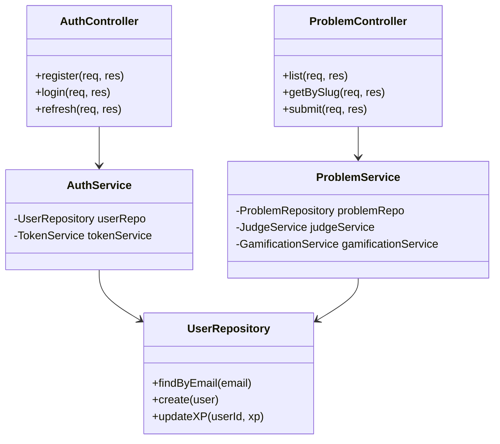
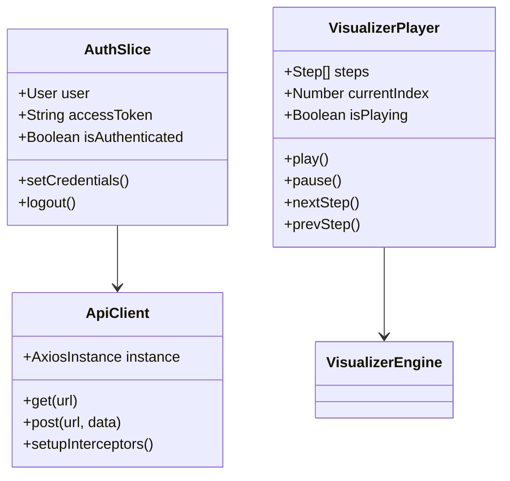

# Class Diagram — ThinkStack (Core Domain)

```mermaid
classDiagram
    class User {
        +ObjectId id
        +String email
        +String username
        +String role
        +GamificationProfile gamification
        +UserStats stats
        +login()
        +updateProfile()
        +addXP(amount)
    }

    class GamificationProfile {
        +Number xp
        +Number level
        +Number coins
        +Streak streak
        +calculateLevel()
    }

    class Topic {
        +ObjectId id
        +String slug
        +String title
        +TopicContent content
        +markComplete(userId)
    }

    class Problem {
        +ObjectId id
        +String slug
        +Difficulty difficulty
        +TestCase[] testCases
        +getStarterCode(lang)
    }

    class Submission {
        +ObjectId id
        +ObjectId userId
        +ObjectId problemId
        +String sourceCode
        +Verdict verdict
        +execute()
    }

    class Quiz {
        +ObjectId id
        +Question[] questions
        +grade(answers)
    }

    class VisualizerEngine {
        +generateSteps(input, config)
        +Step[] steps
        +getStatistics()
    }

    class AuthService {
        +register(dto)
        +login(credentials)
        +refresh(token)
        +logout(userId)
    }

    class JudgeService {
        +submit(code, language, stdin)
        +poll(token)
        +runTestCases(code, cases)
    }

    class AIService {
        +chat(userId, message, context)
        +reviewCode(code)
        +generateHint(problemId, level)
    }

    class GamificationService {
        +awardXP(userId, event)
        +checkBadges(userId)
        +updateStreak(userId)
    }

    User "1" --> "1" GamificationProfile
    User "1" --> "*" Submission
    User "1" --> "*" QuizAttempt
    Problem "1" --> "*" Submission
    Topic "1" --> "0..1" Quiz
    AuthService --> User
    JudgeService --> Submission
    AIService --> User
    GamificationService --> User
    Submission --> JudgeService
```

## Backend Service Layer

```mermaid
classDiagram
    class AuthController {
        +register(req, res)
        +login(req, res)
        +refresh(req, res)
    }

    class ProblemController {
        +list(req, res)
        +getBySlug(req, res)
        +submit(req, res)
    }

    class AuthService {
        -UserRepository userRepo
        -TokenService tokenService
    }

    class ProblemService {
        -ProblemRepository problemRepo
        -JudgeService judgeService
        -GamificationService gamificationService
    }

    class UserRepository {
        +findByEmail(email)
        +create(user)
        +updateXP(userId, xp)
    }

    AuthController --> AuthService
    ProblemController --> ProblemService
    AuthService --> UserRepository
    ProblemService --> UserRepository
```

## Frontend Feature Modules

```mermaid
classDiagram
    class AuthSlice {
        +User user
        +String accessToken
        +Boolean isAuthenticated
        +setCredentials()
        +logout()
    }

    class VisualizerPlayer {
        +Step[] steps
        +Number currentIndex
        +Boolean isPlaying
        +play()
        +pause()
        +nextStep()
        +prevStep()
    }

    class ApiClient {
        +AxiosInstance instance
        +get(url)
        +post(url, data)
        +setupInterceptors()
    }

    AuthSlice --> ApiClient
    VisualizerPlayer --> VisualizerEngine
```
