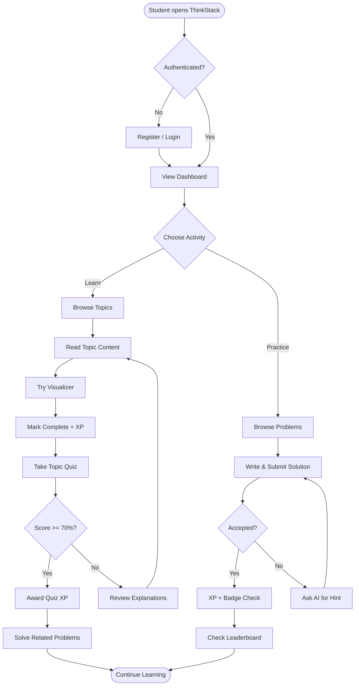

# Component Diagram — ThinkStack

```mermaid
flowchart TB
    subgraph Frontend["Frontend (React)"]
        direction TB
        Router[React Router]
        
        subgraph Pages
            Landing[Landing Page]
            AuthPages[Auth Pages]
            Dashboard[Dashboard]
            Learning[Learning Pages]
            Visualizer[Visualizer Pages]
            Problems[Problem Pages]
            Playground[Playground]
            Quiz[Quiz Pages]
            AIChat[AI Tutor]
            Notes[Notes]
            Progress[Progress]
            Achievements[Achievements]
            Leaderboard[Leaderboard]
            Contests[Contests]
            Admin[Admin Panel]
            Notifications[Notification Bell]
            Search[Global Search]
            Settings[Settings]
        end

        subgraph Features
            AuthFeature[auth/]
            LearnFeature[learning/]
            VizFeature[visualizer/]
            ProbFeature[problems/]
            GameFeature[gamification/]
            NotesFeature[notes/]
            NotifFeature[notifications/]
            SearchFeature[search/]
            SettingsFeature[settings/]
        end

        subgraph Shared
            UIKit[UI Components]
            Redux[Redux Store]
            AxiosSvc[API Client]
            Theme[Theme Provider]
        end

        Router --> Pages
        Pages --> Features
        Features --> Shared
    end

    subgraph Backend["Backend (Express)"]
        direction TB
        App[Express App]
        
        subgraph Routes
            AuthRoutes[/auth]
            TopicRoutes[/topics]
            ProblemRoutes[/problems]
            PlaygroundRoutes[/playground]
            QuizRoutes[/quizzes]
            AIRoutes[/ai]
            NotesRoutes[/notes]
            ProgressRoutes[/progress]
            GameRoutes[/gamification]
            LeaderboardRoutes[/leaderboard]
            ContestRoutes[/contests]
            NotifRoutes[/notifications]
            SearchRoutes[/search]
            SettingsRoutes[/settings]
            AdminRoutes[/admin]
        end

        subgraph Middleware
            AuthMW[JWT Middleware]
            ValidateMW[Validator]
            RateLimitMW[Rate Limiter]
            ErrorMW[Error Handler]
        end

        subgraph Services
            AuthSvc[Auth Service]
            TopicSvc[Topic Service]
            JudgeSvc[Judge Service]
            AISvc[AI Service]
            GameSvc[Gamification Service]
        end

        subgraph Data
            Repos[Repositories]
            Models[Mongoose Models]
        end

        App --> Routes
        Routes --> Middleware
        Middleware --> Services
        Services --> Repos
        Repos --> Models
    end

    subgraph SharedPkg["shared/"]
        AlgoEngines[Algorithm Engines]
        Constants[Constants & Enums]
        Types[Shared Types]
    end

    AxiosSvc -->|REST| App
    VizFeature --> AlgoEngines
    Backend --> SharedPkg
```

## Component Responsibilities

| Component | Responsibility |
|-----------|----------------|
| **React Router** | Route definitions, protected routes, lazy loading |
| **Redux Store** | Auth state, user profile, theme, notifications |
| **API Client** | Axios instance, token refresh interceptor |
| **Auth Service (BE)** | Registration, login, token rotation |
| **Judge Service (BE)** | Judge0 proxy, polling, verdict mapping |
| **AI Service (BE)** | Gemini integration, prompt templates, rate limits |
| **Algorithm Engines (shared)** | Pure step generation for visualizer |
| **Repositories (BE)** | Database access abstraction |

## Activity Diagram — Learning Flow


