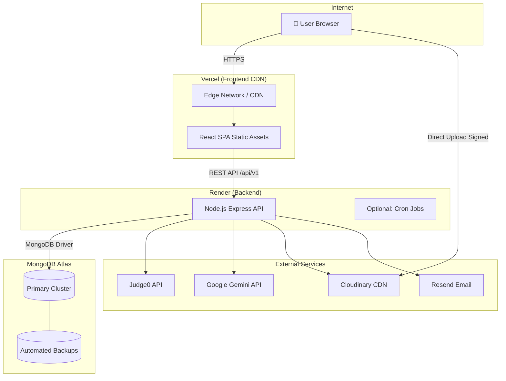
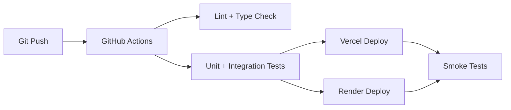

# Deployment Diagram — ThinkStack

## Environment Configuration

| Service | Environment Variables |
|---------|---------------------|
| **Frontend (Vercel)** | `VITE_API_URL`, `VITE_CLOUDINARY_CLOUD_NAME`, `VITE_CLOUDINARY_UPLOAD_PRESET` |
| **Backend (Render)** | `MONGODB_URI`, `JWT_*`, `FRONTEND_URL`, `JUDGE0_*`, `GEMINI_API_KEY`, `GEMINI_MODEL`, `AI_RATE_LIMIT_PER_HOUR`, `CLOUDINARY_*`, `RESEND_API_KEY`, `NODE_ENV` |
| **MongoDB Atlas** | IP whitelist: Render outbound IPs; database user with least privilege |

## Deployment Topology

| Component | Platform | Tier (Dev) | Tier (Prod) |
|-----------|----------|------------|-------------|
| Frontend | Vercel | Hobby | Pro (optional) |
| Backend | Render | Free Web Service | Starter ($7/mo) |
| Database | MongoDB Atlas | M0 Free | M2+ Shared |
| Assets | Cloudinary | Free | Free/Plus |
| Email | Resend | Free (100/day) | Pro |
| AI | Google AI Studio | Free quota | Pay-as-go |
| Compiler | Judge0 RapidAPI | Basic plan | Higher tier |

## CI/CD Pipeline

## Security Boundaries

- All external API keys stored **only** on Render backend
- CORS: `FRONTEND_URL` whitelist
- MongoDB: VPC peering optional; IP allowlist minimum
- JWT secrets: 256-bit random, rotated on compromise
- Refresh cookie: `SameSite=None; Secure` in production for cross-origin Vercel ↔ Render
