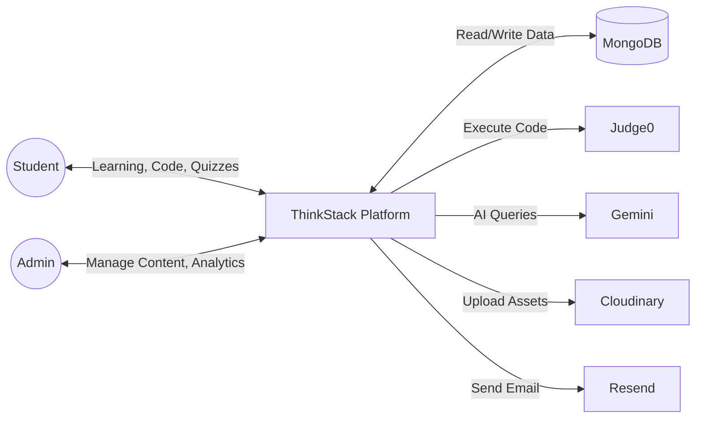
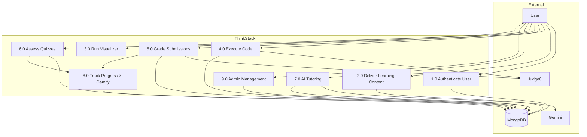

# Data Flow Diagram — ThinkStack

## Level 0 — Context Diagram

## Level 1 — Major Processes

## Data Stores

| Store | Description |
|-------|-------------|
| D1: Users | User accounts, gamification, preferences |
| D2: Content | Topics, problems, quizzes |
| D3: Submissions | Code submissions and results |
| D4: Progress | Topic completion, quiz attempts |
| D5: Platform | Notifications, contests, badges |

## Key Data Flows

| Flow | Data | Direction |
|------|------|-----------|
| Login | credentials → tokens | User → P1 → D1 |
| Study topic | topicId → content | User → P2 → D2 |
| Submit code | source + language → verdict | User → P5 → J0 → D3 |
| Quiz submit | answers → score | User → P6 → D4 |
| AI question | prompt → response | User → P7 → AI → D1 |
| XP update | activity event → xp/level | P8 → D1 |
