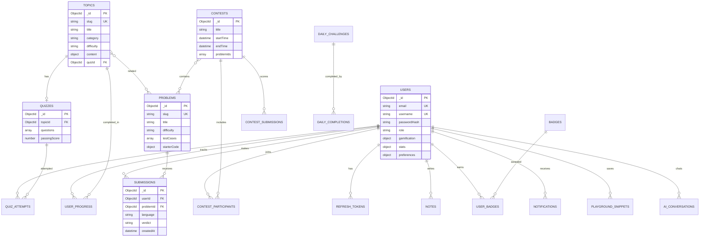

# Entity Relationship Diagram — ThinkStack

## Relationship Notes

| Relationship | Type | Description |
|--------------|------|-------------|
| User → Submissions | 1:N | User can have many code submissions |
| Topic → Quiz | 1:1 | Each topic has one associated quiz |
| Topic → Problems | N:M | Topics link to related practice problems |
| User → UserProgress | 1:N | One progress record per topic per user |
| Contest → Problems | N:M | Contest includes subset of problems |
| Badge → UserBadges | 1:N | Badge definition; many users can earn same badge |
