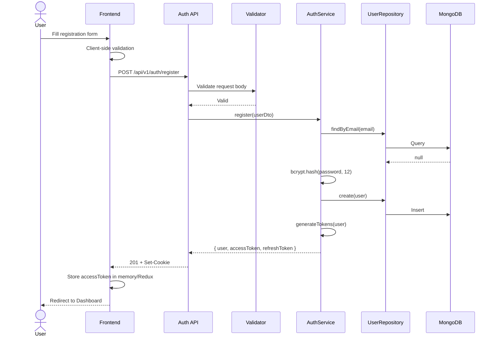
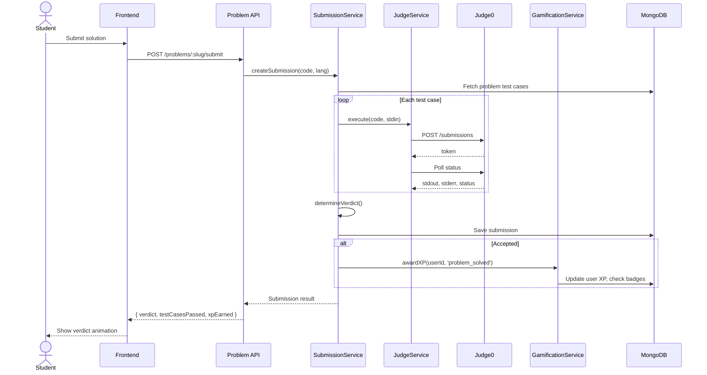
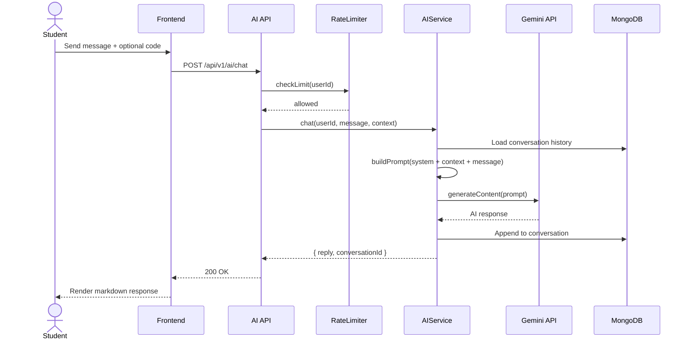
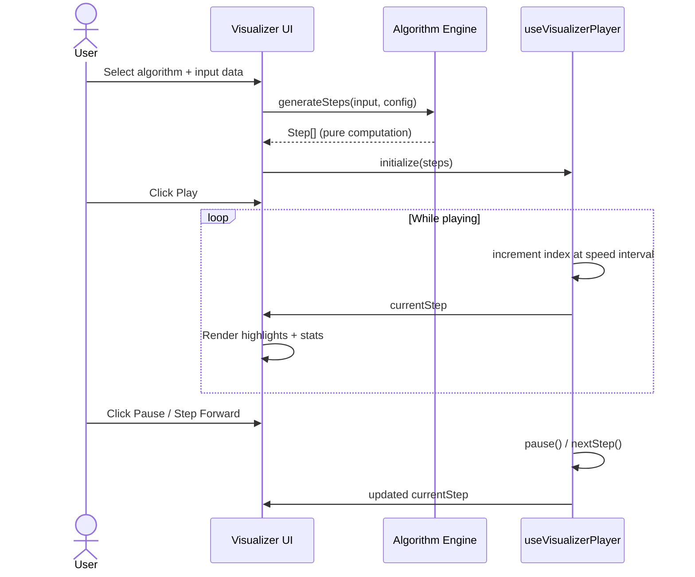
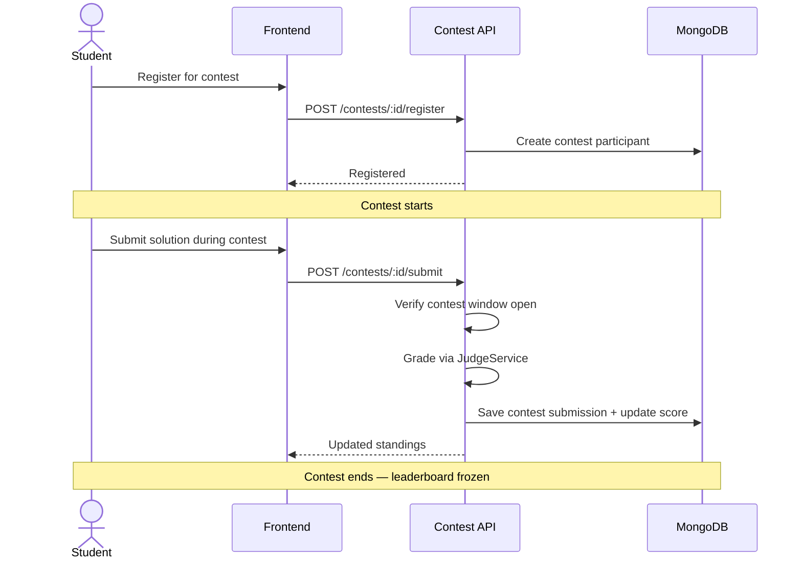

# Sequence Diagrams — ThinkStack

## 1. User Registration

```mermaid
sequenceDiagram
    actor U as User
    participant F as Frontend
    participant A as Auth API
    participant V as Validator
    participant S as AuthService
    participant R as UserRepository
    participant D as MongoDB

    U->>F: Fill registration form
    F->>F: Client-side validation
    F->>A: POST /api/v1/auth/register
    A->>V: Validate request body
    V-->>A: Valid
    A->>S: register(userDto)
    S->>R: findByEmail(email)
    R->>D: Query
    D-->>R: null
    S->>S: bcrypt.hash(password, 12)
    S->>R: create(user)
    R->>D: Insert
    S->>S: generateTokens(user)
    S-->>A: { user, accessToken, refreshToken }
    A-->>F: 201 + Set-Cookie
    F->>F: Store accessToken in memory/Redux
    F-->>U: Redirect to Dashboard
```

## 2. Problem Submission & Grading

```mermaid
sequenceDiagram
    actor U as Student
    participant F as Frontend
    participant P as Problem API
    participant S as SubmissionService
    participant J as JudgeService
    participant J0 as Judge0
    participant G as GamificationService
    participant D as MongoDB

    U->>F: Submit solution
    F->>P: POST /problems/:slug/submit
    P->>S: createSubmission(code, lang)
    S->>D: Fetch problem test cases
    loop Each test case
        S->>J: execute(code, stdin)
        J->>J0: POST /submissions
        J0-->>J: token
        J->>J0: Poll status
        J0-->>J: stdout, stderr, status
    end
    S->>S: determineVerdict()
    S->>D: Save submission
    alt Accepted
        S->>G: awardXP(userId, 'problem_solved')
        G->>D: Update user XP, check badges
    end
    S-->>P: Submission result
    P-->>F: { verdict, testCasesPassed, xpEarned }
    F-->>U: Show verdict animation
```

## 3. AI Tutor Chat

```mermaid
sequenceDiagram
    actor U as Student
    participant F as Frontend
    participant AI as AI API
    participant RL as RateLimiter
    participant S as AIService
    participant G as Gemini API
    participant D as MongoDB

    U->>F: Send message + optional code
    F->>AI: POST /api/v1/ai/chat
    AI->>RL: checkLimit(userId)
    RL-->>AI: allowed
    AI->>S: chat(userId, message, context)
    S->>D: Load conversation history
    S->>S: buildPrompt(system + context + message)
    S->>G: generateContent(prompt)
    G-->>S: AI response
    S->>D: Append to conversation
    S-->>AI: { reply, conversationId }
    AI-->>F: 200 OK
    F-->>U: Render markdown response
```

## 4. Algorithm Visualizer Step Playback

```mermaid
sequenceDiagram
    actor U as User
    participant UI as Visualizer UI
    participant E as Algorithm Engine
    participant P as useVisualizerPlayer

    U->>UI: Select algorithm + input data
    UI->>E: generateSteps(input, config)
    E-->>UI: Step[] (pure computation)
    UI->>P: initialize(steps)
    U->>UI: Click Play
    loop While playing
        P->>P: increment index at speed interval
        P->>UI: currentStep
        UI->>UI: Render highlights + stats
    end
    U->>UI: Click Pause / Step Forward
    P->>P: pause() / nextStep()
    P->>UI: updated currentStep
```

## 5. Contest Participation

```mermaid
sequenceDiagram
    actor U as Student
    participant F as Frontend
    participant C as Contest API
    participant D as MongoDB

    U->>F: Register for contest
    F->>C: POST /contests/:id/register
    C->>D: Create contest participant
    C-->>F: Registered

    Note over U,D: Contest starts

    U->>F: Submit solution during contest
    F->>C: POST /contests/:id/submit
    C->>C: Verify contest window open
    C->>C: Grade via JudgeService
    C->>D: Save contest submission + update score
    C-->>F: Updated standings

    Note over U,D: Contest ends — leaderboard frozen
```
