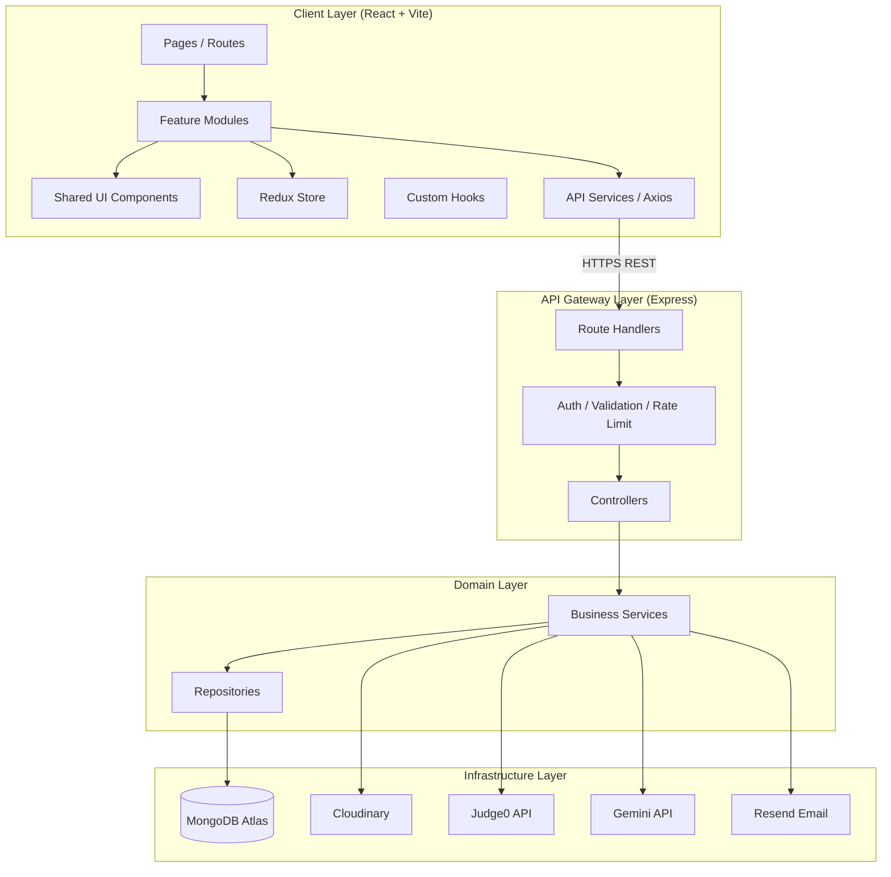
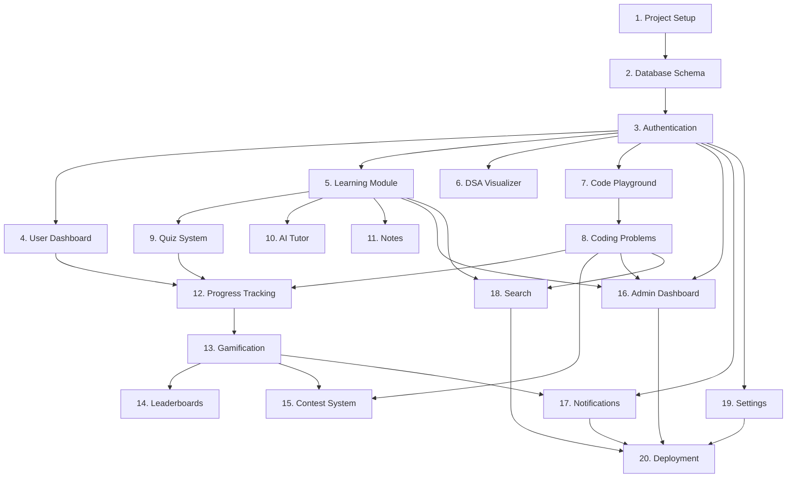
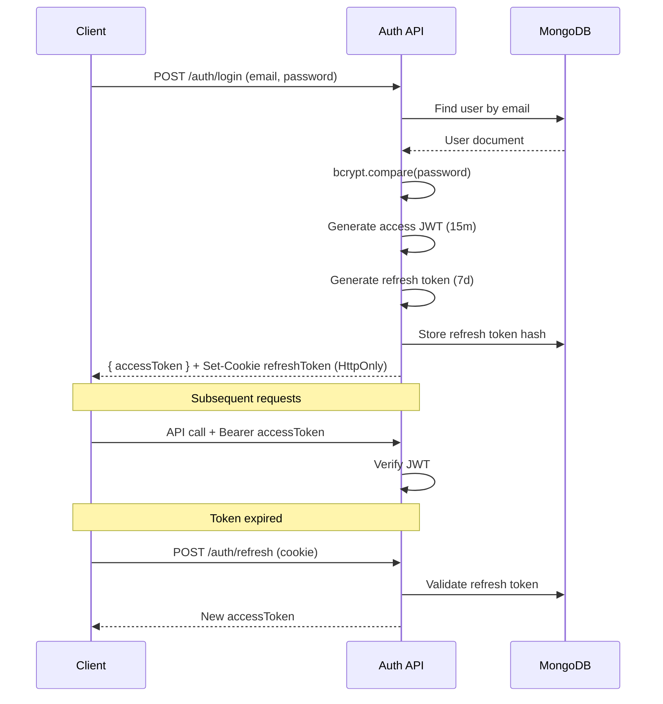
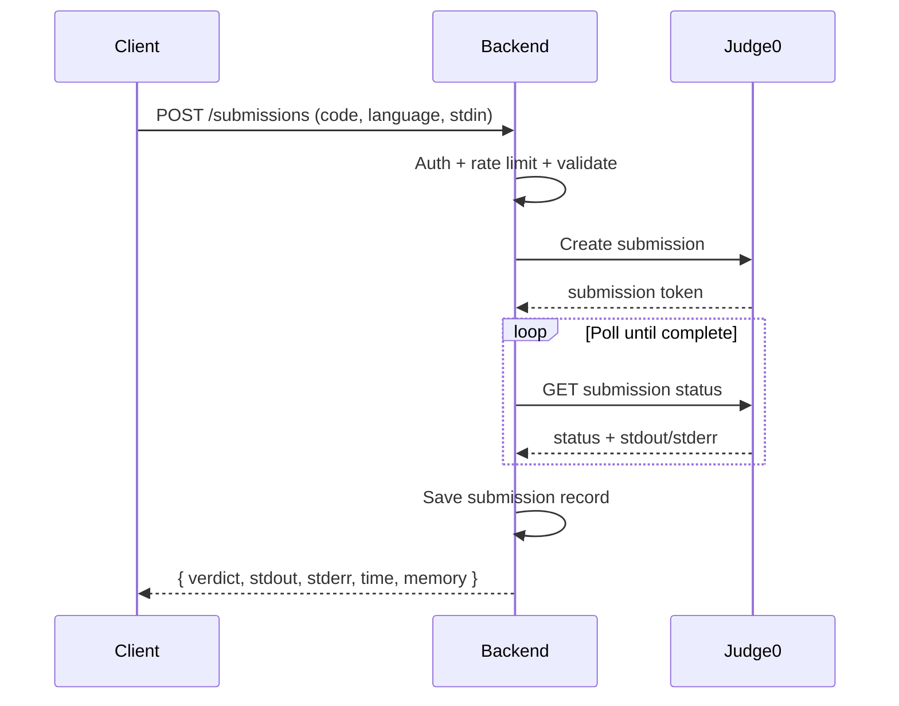

# ThinkStack — System Architecture

**Version:** 1.0.0  
**Date:** June 27, 2026

---

## 1. Architectural Style

ThinkStack follows **Clean Architecture** with **MVC** on the backend and **Feature-Sliced Design** on the frontend.

### Decision Rationale

| Decision | Choice | Why |
|----------|--------|-----|
| Monorepo folders | `frontend/`, `backend/`, `shared/`, `documentation/` | Clear separation; shared types avoid duplication; single repo for university project |
| API style | REST (JSON) | Simple, well-understood, excellent tooling; sufficient for v1.0 |
| State management | Redux Toolkit | Predictable global state for auth, user, theme; DevTools; scales with 20 modules |
| Database | MongoDB (document) | Flexible schema for nested topic content, test cases, quiz questions |
| Auth pattern | JWT access + HTTP-only refresh cookie | Stateless API; XSS-resistant refresh storage |
| Code execution | Judge0 proxy (backend only) | API key security; centralized rate limiting |
| AI | Server-side Gemini proxy | Never expose keys; prompt injection mitigation layer |
| Visualizer | Client-side step engine + React Flow | No server round-trips per animation step; 60fps capable |
| File uploads | Cloudinary direct upload with signed preset | Offload bandwidth; CDN delivery |
| Deployment split | Vercel + Render | Free tiers suitable for FYP; independent scaling |

---

## 2. High-Level Architecture



---

## 3. Backend Layer Architecture (MVC + Repository)

```
backend/
├── src/
│   ├── config/           # env, db, cloudinary, cors
│   ├── middleware/       # auth, validate, error, rateLimit
│   ├── models/           # Mongoose schemas
│   ├── repositories/     # Data access abstraction
│   ├── services/         # Business logic
│   ├── controllers/      # HTTP request handlers
│   ├── routes/           # Express routers
│   ├── validators/       # express-validator schemas
│   ├── utils/            # helpers, logger, apiResponse
│   ├── jobs/             # cron: streak reset, leaderboard
│   └── app.js            # Express app factory
├── tests/
└── server.js
```

**Flow:** `Route → Middleware → Controller → Service → Repository → Model`

### Why Repository Pattern?

- Decouples Mongoose queries from business logic
- Enables unit testing with mock repositories
- Centralizes query optimization and indexing usage

---

## 4. Frontend Architecture (Feature-Sliced)

```
frontend/
├── src/
│   ├── app/              # store, router, providers
│   ├── features/         # auth, learning, visualizer, problems, ...
│   │   └── [feature]/
│   │       ├── components/
│   │       ├── hooks/
│   │       ├── services/
│   │       └── slice.ts
│   ├── pages/            # route-level composition
│   ├── components/       # shared UI (Button, Modal, Card)
│   ├── hooks/            # useTheme, useDebounce, useMediaQuery
│   ├── services/         # axios instance, interceptors
│   ├── utils/            # formatters, constants
│   ├── assets/
│   └── styles/           # Tailwind globals, design tokens
```

---

## 5. Module Dependency Graph



---

## 6. Authentication Flow



---

## 7. Code Execution Flow



---

## 8. Visualizer Architecture

The visualizer uses a **pure step-generator pattern**:

1. **Algorithm Engine** (`shared/algorithms/`) — Pure functions: `(input, config) → Step[]`
2. **Step Schema** — `{ type, highlights, metadata, description }`
3. **Player Hook** — `useVisualizerPlayer(steps)` — play/pause/index/speed
4. **Renderer** — React components per algorithm type (array bars, graph canvas, tree nodes)

**Benefits:**
- Algorithms testable without UI
- Same engines usable for "quiz complexity" questions
- Previous/next step is O(1) array index

---

## 9. Security Architecture

| Layer | Mechanism |
|-------|-----------|
| Transport | HTTPS (Vercel/Render enforced) |
| Headers | Helmet (CSP, HSTS, X-Frame-Options) |
| Auth | JWT RS256 or HS256; short-lived access tokens |
| Input | express-validator + mongo-sanitize |
| Rate Limit | express-rate-limit per route group |
| CORS | Whitelist `FRONTEND_URL` only |
| Secrets | `.env` on server; Vercel/Render env vars |
| Uploads | Cloudinary signed uploads; MIME validation |
| AI | System prompt hardening; user input sanitization |

---

## 10. Technology Stack Summary

| Layer | Technology |
|-------|------------|
| Frontend Framework | React 18 + Vite 5 |
| Styling | Tailwind CSS 3 + custom design tokens |
| Routing | React Router 6 |
| State | Redux Toolkit |
| HTTP | Axios with interceptors |
| Animation | Framer Motion |
| Graphs/ Trees UI | React Flow |
| Charts | Chart.js + react-chartjs-2 |
| Code Editor | Monaco Editor (@monaco-editor/react) |
| Backend Runtime | Node.js 20 LTS |
| Backend Framework | Express.js 4 |
| ODM | Mongoose 8 |
| Validation | express-validator |
| Auth | jsonwebtoken + bcryptjs |
| Security | helmet, cors, express-rate-limit, express-mongo-sanitize |
| Logging | morgan + winston |
| Testing | Vitest (frontend), Jest + Supertest (backend) |
| CI | GitHub Actions |
| Frontend Host | Vercel |
| Backend Host | Render |
| Database | MongoDB Atlas |
| Storage | Cloudinary |
| Email | Resend |
| AI | Google Gemini API |
| Compiler | Judge0 API |

---

## 11. Scalability Considerations

| Concern | Strategy |
|---------|----------|
| Read-heavy leaderboards | Aggregated `UserStats` collection; optional Redis cache |
| Code execution bottleneck | Queue submissions; Judge0 RapidAPI scaling |
| AI cost | Rate limits; response caching for common concepts |
| Large topic content | Pagination; lazy load sections |
| File assets | Cloudinary CDN |
| Database growth | TTL indexes on sessions/logs; archive old submissions |

---

## 12. API Design Conventions

- Base URL: `https://api.thinkstack.app/api/v1`
- Response envelope: `{ success, data, message, meta }`
- Errors: `{ success: false, error: { code, message, details } }`
- Pagination: `?page=1&limit=20` → `meta: { page, limit, total, pages }`
- Versioning: URL prefix `/api/v1`

---

*Next: See `DATABASE_DESIGN.md`, `ROADMAP.md`, and `documentation/diagrams/` for detailed diagrams.*
