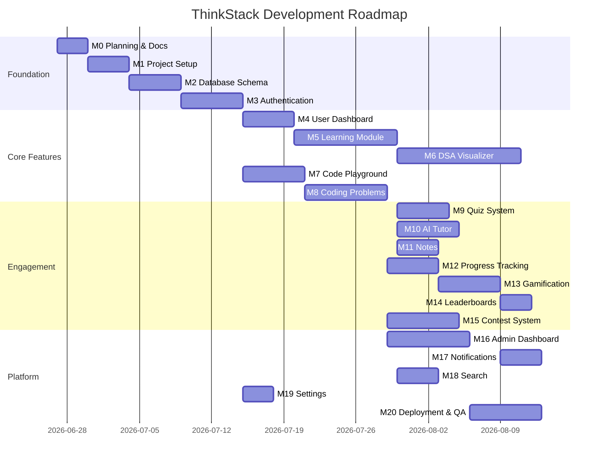

# ThinkStack — Milestone Roadmap

**Project Duration:** 20 Milestones (Module-Aligned)  
**Approach:** Complete one milestone before proceeding to the next

---

## Overview Timeline

---

## Milestone 0: Planning & Documentation ✅

**Goal:** Complete SRS, architecture, personas, user stories, use cases, diagrams, project scope.

**Deliverables:**
- [x] SRS.md
- [x] ARCHITECTURE.md
- [x] DATABASE_DESIGN.md
- [x] USER_STORIES.md
- [x] PERSONAS.md
- [x] USE_CASES.md
- [x] ROADMAP.md
- [x] Diagrams (ERD, use case, deployment, DFD)
- [x] Project scope document
- [x] Root README

---

## Milestone 1: Complete Project Setup ✅

**Goal:** Monorepo scaffold, tooling, CI baseline, environment templates.

**Deliverables:**
- [x] Frontend (Vite + React + Tailwind + Redux + Router + Axios + Framer Motion)
- [x] Backend (Express + security middleware + health endpoint)
- [x] Shared package (constants, types)
- [x] ESLint + Prettier
- [x] GitHub Actions CI
- [x] Installation Guide
- [x] Design system tokens + dark/light theme
- [x] Landing page + dashboard shell + routing

**Exit Criteria:** `npm run dev` works for both; lint passes; folder structure matches architecture doc. ✅

---

## Milestone 2: Database Schema ✅

**Goal:** All Mongoose models, indexes, validators, seed script.

**Deliverables:**
- [x] 21 Mongoose models with indexes
- [x] Repository layer (Base + 7 entity repositories)
- [x] Seed script (admin, 22 topics, 55 problems, 22 quizzes, 30 badges, 7 daily challenges)
- [x] Repository unit tests (12 tests passing)
- [x] Gamification level utility

**Exit Criteria:** Seed populates admin + sample data; all indexes created; repository unit tests pass. ✅

---

## Milestone 3: Authentication ✅

**Goal:** Register, login, refresh, logout, password reset, RBAC middleware.

**Deliverables:**
- [x] JWT access tokens (15 min) + HTTP-only refresh cookies (7 days)
- [x] Refresh token rotation with hashed storage
- [x] Register, login, logout, refresh, /me endpoints
- [x] Forgot/reset password (Resend with dev console fallback)
- [x] Rate limiting (5 req/min on auth endpoints)
- [x] Account lockout after 5 failed logins
- [x] RBAC middleware (`authenticate`, `authorize`)
- [x] Frontend auth pages + protected routes
- [x] 8 integration tests for auth API

**Exit Criteria:** Full auth flow E2E; protected routes enforced; refresh rotation works. ✅

---

## Milestone 4: User Dashboard ✅

**Goal:** Student dashboard with progress widgets, streak, daily challenge placeholder, navigation shell.

**Deliverables:**
- [x] GET /api/v1/dashboard — progress summary, daily challenge, recommendations, recent activity
- [x] DashboardService with category progress aggregation
- [x] Frontend dashboard feature (service, hook, components)
- [x] Chart.js category progress chart
- [x] Daily challenge, recommended topic, recent activity widgets
- [x] Loading skeletons and empty states
- [x] Mobile bottom navigation for app shell
- [x] 3 dashboard integration tests

**Exit Criteria:** Responsive dashboard; sidebar nav to all modules; empty states for new users. ✅

---

## Milestone 5: Learning Module ✅

**Goal:** 22 topics with full content structure, topic reader UI, completion tracking.

**Deliverables:**
- [x] GET /api/v1/topics — list by category with user progress
- [x] GET /api/v1/topics/:slug — full topic reader payload
- [x] PATCH /api/v1/topics/:slug/progress — in_progress / completed with XP hook
- [x] LearningService with one-time XP award on completion
- [x] Learn page with category sections and progress badges
- [x] Topic reader rendering all content sections
- [x] Code examples with syntax styling, markdown theory renderer
- [x] Mark complete syncs gamification to Redux
- [x] 5 learning integration tests

**Exit Criteria:** All topics seeded; reader renders all sections; mark complete awards XP hook ready. ✅

---

## Milestone 6: DSA Visualizer ✅

**Goal:** All specified algorithms with step engine, controls, statistics.

**Deliverables:**
- [x] Shared pure step engines (`shared/algorithms/`) — 26 algorithms
- [x] Searching (4), Sorting (10), Trees (4), Graphs (8)
- [x] `useVisualizerPlayer` hook — play/pause/step/speed/scrub
- [x] Array, graph (React Flow), tree (React Flow), matrix renderers
- [x] Random + custom data input; search target input
- [x] Statistics panel (comparisons, swaps, steps)
- [x] Keyboard controls (Space, arrows)
- [x] Visualizer catalog page + workspace routes
- [x] Topic slug → algorithm mapping for learning links
- [x] 8 algorithm unit tests

**Exit Criteria:** Every algorithm in spec animates correctly; custom/random data works. ✅

---

## Milestone 7: Code Playground ✅

**Goal:** Monaco editor, Judge0 integration, save/history.

**Deliverables:**
- [x] Judge0Service — proxy with mock mode for dev/test
- [x] PlaygroundService — run code, snippets CRUD, submission history
- [x] POST /api/v1/playground/run — rate limited code execution
- [x] GET/POST/PATCH/DELETE /api/v1/playground/snippets
- [x] GET /api/v1/playground/history
- [x] Monaco editor with 5 languages, stdin/stdout panels
- [x] Save, copy, download snippets; sidebar with saved + history
- [x] 6 playground integration tests

**Exit Criteria:** 5 languages execute; snippets persist. ✅

---

## Milestone 8: Coding Problems ✅

**Goal:** Problem list, detail, submission, verdicts, 50+ seeded problems.

**Deliverables:**
- [x] GET /api/v1/problems — filter by difficulty, topic, status, search
- [x] GET /api/v1/problems/:slug — detail with hidden tests stripped
- [x] POST /api/v1/problems/:slug/run — sample run against first example
- [x] POST /api/v1/problems/:slug/submit — grade all test cases via Judge0
- [x] GET /api/v1/problems/:slug/submissions — user submission history
- [x] ProblemService with XP on first accept, acceptance rate stats
- [x] Problems list + detail pages with Monaco editor
- [x] 7 problems integration tests + 4 codeExecution unit tests

**Exit Criteria:** Automated grading against hidden tests; filter/search on problem list. ✅

---

## Milestone 9: Quiz System ✅

**Goal:** Topic-linked quizzes, scoring, explanations.

**Deliverables:**
- [x] GET /api/v1/quizzes — list with topic, best score, pass status
- [x] GET /api/v1/quizzes/:id — questions without answers (secure)
- [x] POST /api/v1/quizzes/:id/submit — grade, explanations, XP on pass (≥70%)
- [x] GET /api/v1/quizzes/:id/attempts — attempt history
- [x] Timed mode support via `timeLimitMinutes` + client timer
- [x] Quizzes list + take pages with instant feedback review
- [x] 7 integration tests + 3 grading unit tests

**Exit Criteria:** Topic-linked MCQ quizzes; instant feedback; XP on pass. ✅

---

## Milestone 10: AI Tutor ✅

**Goal:** Gemini proxy, chat UI, rate limiting, context injection.

**Deliverables:**
- [x] GeminiService — server-side proxy with mock mode for dev/test
- [x] AITutorService — conversations, chat history, context injection
- [x] GET/POST/DELETE /api/v1/ai/conversations
- [x] POST /api/v1/ai/chat — rate limited (20/hour per user)
- [x] Topic/problem context injected into system prompt
- [x] Last 50 conversations retained per user
- [x] Chat UI with sidebar, suggested prompts, markdown replies
- [x] 6 AI tutor integration tests

**Exit Criteria:** Gemini proxy functional; chat UI; rate limits; context injection. ✅

---

## Milestone 11: Notes ✅

**Goal:** CRUD notes linked to topics/problems.

**Deliverables:**
- [x] NoteRepository with soft delete and text search
- [x] NotesService — list/filter/search, CRUD with topic/problem linking
- [x] GET/POST/PATCH/DELETE /api/v1/notes
- [x] Markdown note editor with preview
- [x] Notes page with sidebar, search, tag/topic/problem filters
- [x] Links from topic reader and problem detail pages
- [x] 7 notes integration tests

**Exit Criteria:** User can create, read, update, delete, search/filter own notes linked to topics/problems. ✅

---

## Milestone 12: Progress Tracking ✅

**Goal:** Aggregates, Chart.js visualizations, weak area detection.

**Deliverables:**
- [x] GET /api/v1/progress — overview, category breakdown, activity timeline, time by module
- [x] ProgressService with weak area detection (categories, topics, quizzes, problems)
- [x] Session time tracking via PATCH /topics/:slug/progress `{ addMinutes }`
- [x] Progress page with line/bar Chart.js charts
- [x] WeakAreasPanel with actionable links
- [x] Topic reader records study time on page leave
- [x] 5 progress integration tests

**Exit Criteria:** User sees aggregated progress, charts over time, and weak area recommendations. ✅

---

## Milestone 13: Gamification ✅

**Goal:** XP, levels, badges, coins, daily challenges, streaks.

**Deliverables:**
- [x] GamificationService — streak tracking, badge evaluation, daily challenge completion
- [x] GET /api/v1/gamification — level progress, badges, coins, daily challenge
- [x] Coins earned on topic/quiz/problem activities and badge bonuses
- [x] Daily challenge auto-completion with bonus XP + coins
- [x] Badge unlock with toast notifications
- [x] Achievements page (`/achievements`) with level bar, streak, badge grid
- [x] Hooks integrated across learning, problems, quizzes
- [x] 6 gamification integration tests + level progress unit test

**Exit Criteria:** XP/levels/badges/coins/streaks/daily challenges operational end-to-end. ✅

---

## Milestone 14: Leaderboards ✅

**Goal:** Global/weekly rankings, user rank display.

**Deliverables:**
- [x] LeaderboardRepository — global rank, weekly XP aggregation from activity records
- [x] LeaderboardService + GET /api/v1/leaderboard (`?period=global|weekly`, `?limit=`)
- [x] Current user rank highlighted (including outside top 100)
- [x] Leaderboard badge evaluation wired (top 100 / top 10)
- [x] Frontend `/leaderboard` with period toggle and rank card
- [x] 6 leaderboard integration tests

**Exit Criteria:** User sees global (and weekly) rankings with their rank displayed. ✅

---

## Milestone 15: Contest System ✅

**Goal:** Timed contests, scoring, contest leaderboard.

**Deliverables:**
- [x] ContestRepository, ContestParticipantRepository, ContestSubmissionRepository
- [x] ContestService — ICPC-style scoring, registration, submission window enforcement
- [x] GET/POST /api/v1/contests, register, leaderboard, contest problem run/submit
- [x] Admin POST /api/v1/contests for contest creation (seed + API)
- [x] Sample contests in seed script
- [x] Frontend `/contests`, contest room, in-contest problem workspace
- [x] Contest participant/winner badge wiring
- [x] 7 integration tests + contest scoring unit test

**Exit Criteria:** Users can register, submit during active window, and view score + penalty leaderboard. ✅

---

## Milestone 16: Admin Dashboard ✅

**Goal:** Full CRUD + analytics for all entities.

**Deliverables:**
- [x] AdminService — analytics, user management, content CRUD, announcements, CSV export
- [x] GET/PATCH /api/v1/admin/users
- [x] GET/POST/PATCH /api/v1/admin/topics, problems, quizzes, contests
- [x] GET/POST/PATCH /api/v1/admin/announcements with user notifications
- [x] GET /api/v1/admin/analytics — growth, submissions, popular topics
- [x] GET /api/v1/admin/export/:type — users/submissions CSV
- [x] Audit logging for admin mutations
- [x] Frontend `/admin` dashboard with tabs, charts, management panels
- [x] 7 admin integration tests

**Exit Criteria:** Admin can manage users/content, post announcements, and view analytics. ✅

---

## Milestone 17: Notifications ✅

**Goal:** In-app notification center + triggers.

**Deliverables:**
- [x] NotificationRepository + NotificationService
- [x] GET /api/v1/notifications, unread-count, mark read/unread, read-all, bulk clear
- [x] Frontend notification bell + dropdown panel in Navbar
- [x] Triggers: badge unlock, contest register/start/complete, streak reminder, announcements
- [x] 8 notification integration tests

**Exit Criteria:** User sees in-app notification center with read/unread and bulk clear; types cover achievement/contest/announcement/streak. ✅

---

## Milestone 18: Search ✅

**Goal:** Global search with MongoDB text indexes.

**Deliverables:**
- [x] SearchRepository — MongoDB `$text` queries on topics, problems, user notes
- [x] GET /api/v1/search — grouped results (topics, problems, notes)
- [x] GET /api/v1/search/suggest — autocomplete suggestions
- [x] Frontend global search bar in Navbar (debounced, grouped dropdown)
- [x] 7 search integration tests + 1 unit test

**Exit Criteria:** Student can search topics, problems, and own notes from navbar; results ranked by text relevance. ✅

---

## Milestone 19: Settings ✅

**Goal:** Theme, editor prefs, profile, account management.

**Deliverables:**
- [x] SettingsService — preferences, profile, password change, GDPR account deletion
- [x] GET /api/v1/settings, PATCH preferences/profile/password, DELETE account
- [x] Settings page — theme, editor, notifications, profile, password, delete account
- [x] User preference sync to Redux/theme; Monaco editor font/tab from preferences
- [x] 7 settings integration tests

**Exit Criteria:** User can persist theme and editor prefs, update profile, change password, and delete account. ✅

---

## Milestone 20: Deployment & QA ✅

**Goal:** Vercel + Render + Atlas production deploy, CI/CD, documentation finalization, test suite green.

**Deliverables:**
- [x] DEPLOYMENT.md
- [x] API_DOCUMENTATION.md (OpenAPI)
- [x] All diagrams finalized
- [x] Production smoke tests
- [x] CI/CD MongoDB service for integration tests
- [x] `vercel.json`, `render.yaml` deploy configs

**Exit Criteria:** Production deploy documented and runnable; API documented; tests green; project demo-ready for v1.0. ✅

---

## Risk Register

| Risk | Impact | Mitigation |
|------|--------|------------|
| Judge0 rate limits | High | Queue + user rate limits; clear error UX |
| Gemini API cost | Medium | Rate limits; cache common responses |
| Visualizer complexity | High | Pure step engines; incremental algorithm delivery |
| Scope creep | High | Strict milestone gates; P0 only for v1.0 |
| Render cold starts | Medium | Health check ping; loading states |

---

## Definition of Done (Per Milestone)

1. Feature complete per SRS acceptance criteria
2. Code reviewed and refactored
3. Unit/integration tests written
4. API documented (if applicable)
5. No critical security issues
6. Documentation updated
7. Demo-able increment

---

**Current Status:** Milestone 20 — Deployment & QA ✅ Complete  
**Project:** v1.0 demo-ready
