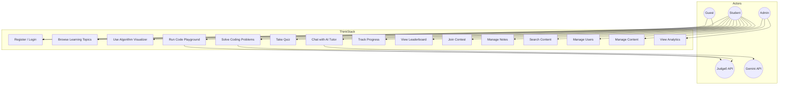

# ThinkStack — Use Cases

## Use Case Diagram (Overview)

---

## UC-001: User Registration

| Field | Value |
|-------|-------|
| **Actor** | Guest |
| **Preconditions** | Valid email not already registered |
| **Postconditions** | User account created; student role assigned; verification optional |
| **Main Flow** | 1. Guest opens register page → 2. Enters username, email, password → 3. System validates input → 4. Password hashed and stored → 5. JWT + refresh token issued → 6. Redirect to onboarding/dashboard |
| **Alternate Flow** | 3a. Email exists → show error → return to form |
| **Exceptions** | Database unavailable → 503 with retry message |

---

## UC-002: User Login

| Field | Value |
|-------|-------|
| **Actor** | Guest, Student |
| **Preconditions** | Account exists and is not suspended |
| **Postconditions** | Authenticated session established |
| **Main Flow** | 1. Enter credentials → 2. Validate → 3. Compare bcrypt hash → 4. Issue tokens → 5. Update lastLogin, streak logic → 6. Navigate to dashboard |
| **Alternate Flow** | 3a. Invalid password → increment failed attempts → lock after 5 failures (15 min) |

---

## UC-003: Study Learning Topic

| Field | Value |
|-------|-------|
| **Actor** | Student |
| **Preconditions** | Authenticated |
| **Main Flow** | 1. Browse topic catalog → 2. Select topic → 3. Read sections (theory, examples, complexity) → 4. Watch embedded animations → 5. Mark complete → 6. XP awarded → 7. Link to quiz/problems |
| **Includes** | UC-008 (Track Progress) |

---

## UC-004: Visualize Algorithm

| Field | Value |
|-------|-------|
| **Actor** | Student, Guest (demo mode) |
| **Preconditions** | Algorithm selected |
| **Main Flow** | 1. Choose algorithm category → 2. Configure data (random/custom) → 3. Press Play → 4. System generates step array → 5. UI renders each step with highlights → 6. User pauses/steps manually → 7. Statistics update |
| **Extensions** | 4a. Invalid custom input → validation error |

---

## UC-005: Execute Code in Playground

| Field | Value |
|-------|-------|
| **Actor** | Student |
| **Preconditions** | Authenticated; Judge0 available |
| **Main Flow** | 1. Select language → 2. Write code in Monaco → 3. Provide stdin → 4. Click Run → 5. Backend proxies to Judge0 → 6. Display stdout/stderr → 7. Optional: save snippet |
| **Exceptions** | Judge0 timeout → show TLE message |

---

## UC-006: Submit Problem Solution

| Field | Value |
|-------|-------|
| **Actor** | Student |
| **Preconditions** | Problem published; user authenticated |
| **Main Flow** | 1. Open problem → 2. Write solution → 3. Run sample tests (optional) → 4. Submit → 5. Backend runs all test cases via Judge0 → 6. Verdict returned → 7. If Accepted: XP, update solve count, check badges |
| **Includes** | UC-008 |

---

## UC-007: Take Topic Quiz

| Field | Value |
|-------|-------|
| **Actor** | Student |
| **Main Flow** | 1. Start quiz from topic → 2. Answer MCQs → 3. Submit → 4. Score calculated → 5. Show explanations → 6. If pass: award XP, update progress |

---

## UC-008: Interact with AI Tutor

| Field | Value |
|-------|-------|
| **Actor** | Student |
| **Preconditions** | Within rate limit |
| **Main Flow** | 1. Open AI chat → 2. Type question or paste code → 3. Backend builds prompt with context → 4. Call Gemini API → 5. Stream/return response → 6. Save to chat history |
| **Alternate Flow** | Rate limit exceeded → show cooldown timer |

---

## UC-009: View Progress Dashboard

| Field | Value |
|-------|-------|
| **Actor** | Student |
| **Main Flow** | 1. Open dashboard → 2. Fetch progress aggregates → 3. Render charts, streak, XP, recommendations |

---

## UC-010: Participate in Contest

| Field | Value |
|-------|-------|
| **Actor** | Student |
| **Preconditions** | Contest active; user registered for contest |
| **Main Flow** | 1. Enter contest room → 2. Timer displayed → 3. Solve problems → 4. Submissions scored with penalty → 5. Live leaderboard updates → 6. Contest ends → final standings frozen |

---

## UC-011: Admin Manage Content

| Field | Value |
|-------|-------|
| **Actor** | Admin |
| **Preconditions** | Admin role |
| **Main Flow** | 1. Open admin panel → 2. Select entity (topic/problem/quiz/contest) → 3. CRUD operations → 4. Publish/unpublish → 5. Changes reflected immediately |

---

## UC-012: Global Search

| Field | Value |
|-------|-------|
| **Actor** | Student |
| **Main Flow** | 1. Enter query in search bar → 2. Debounced API call → 3. MongoDB text search across indexed collections → 4. Grouped results displayed → 5. Click navigates to entity |

---

## Use Case ↔ Requirement Traceability

| Use Case | SRS Requirements |
|----------|------------------|
| UC-001, UC-002 | FR-AUTH-* |
| UC-003 | FR-LEARN-* |
| UC-004 | FR-VIZ-* |
| UC-005 | FR-PLAY-* |
| UC-006 | FR-PROB-* |
| UC-007 | FR-QUIZ-* |
| UC-008 | FR-AI-* |
| UC-009 | FR-PROG-*, FR-GAME-* |
| UC-010 | FR-CONT-* |
| UC-011 | FR-ADMIN-* |
| UC-012 | FR-SEARCH-* |
